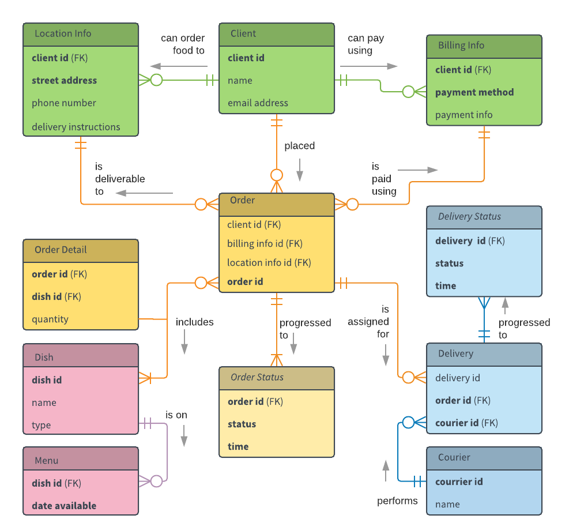

These instructions assume Docker is [installed](https://docs.docker.com/), the deamon/process is running an accessible to a CLI client, and is shown using Mac OS terminal.

Launch the container and load schema into it
```
# download and run mySQL in a container
$ docker pull mysql
$ docker run --name express_food -e MYSQL_ROOT_PASSWORD=my-secret-pw -d mysql:latest


### load schema

# navigate to directory where the repo is cloned
$ cd [project directory]

# make SQL file available to the container
$ docker cp ./schema.sql express_food:/

# run SQL file within container
$ docker exec express_food /bin/sh -c 'exec mysql  -uroot -p"my-secret-pw" </schema.sql'
```

Verify results:
```
### run client & observe
$ docker run -it --link express_food:mysql --rm mysql sh -c 'exec mysql -h"$MYSQL_PORT_3306_TCP_ADDR" -P"$MYSQL_PORT_3306_TCP_PORT" -uroot -p"$MYSQL_ENV_MYSQL_ROOT_PASSWORD"'

# - - - observe
mysql> show databases;
+--------------------+
| Database           |
+--------------------+
| express_food       |
...

mysql> use express_food;
...

Database changed

mysql> show tables;
+------------------------+
| Tables_in_express_food |
+------------------------+
| billing_info           |
| client                 |
| courier                |
| delivery               |
| delivery_status        |
| dish                   |
| location_info          |
| menu                   |
| order                  |
| order_detail           |
| order_status           |
+------------------------+
11 rows in set (0.01 sec)

mysql> show CREATE TABLE billing_info;
+--------------+----------------------------------------------------------------------------------------------------------------------------------------------------------------------------------------------------------------------------------------------------------------------------------------------------------------------------------------------------------------------------------------------------------------------------------------------------+
| Table        | Create Table                                                                                                                                                                                                                                                                                                                                                                                                                                       |
+--------------+----------------------------------------------------------------------------------------------------------------------------------------------------------------------------------------------------------------------------------------------------------------------------------------------------------------------------------------------------------------------------------------------------------------------------------------------------+
| billing_info | CREATE TABLE `billing_info` (
  `id` int(10) unsigned NOT NULL AUTO_INCREMENT,
  `client_id` int(10) unsigned NOT NULL,
  `payment_method` enum('cash','credit card') NOT NULL,
  `payment_info` varchar(255) DEFAULT NULL,
  PRIMARY KEY (`client_id`,`payment_method`),
  UNIQUE KEY `id` (`id`),
  CONSTRAINT `billing_info_ibfk_1` FOREIGN KEY (`client_id`) REFERENCES `client` (`id`) ON DELETE CASCADE
) ENGINE=InnoDB DEFAULT CHARSET=utf8 |
+--------------+----------------------------------------------------------------------------------------------------------------------------------------------------------------------------------------------------------------------------------------------------------------------------------------------------------------------------------------------------------------------------------------------------------------------------------------------------+
1 row in set (0.00 sec)


### etc.
mysql> exit
Bye
```

Load sample data:
```
### Load sample data
# make SQL file available to the container
$ docker cp ./express_food_data.sql express_food:/

# run SQL file within container
$ docker exec express_food /bin/sh -c 'exec mysql  -uroot -p"my-secret-pw" </express_food_data.sql'
...
sleep(2)
0
sleep(2)
0
...

## note: - sleep() is used to generate meaningful time-stamped status tables data
```

Verify data is loaded
```
### run client
docker run -it --link express_food:mysql --rm mysql sh -c 'exec mysql -h"$MYSQL_PORT_3306_TCP_ADDR" -P"$MYSQL_PORT_3306_TCP_PORT" -uroot -p"$MYSQL_ENV_MYSQL_ROOT_PASSWORD"'

mysql> use express_food;
...
Database changed


mysql> SELECT * from client;
+----+---------------+----------------------------+-------------------+
| id | name          | email_address              | cell_phone_number |
+----+---------------+----------------------------+-------------------+
|  1 | Bilbo Baggins | bilbo.baggins@hobiton.com  | 111-1111          |
|  2 | Frodo Baggins | frodo.baggins@hobbiton.com | 333-3333          |
|  3 | Sam Gamgee    | sam.gamgee@hobbiton.com    | 222-2222          |
+----+---------------+----------------------------+-------------------+
3 rows in set (0.00 sec)
```

Included usescases can be now run to assess the schema.



